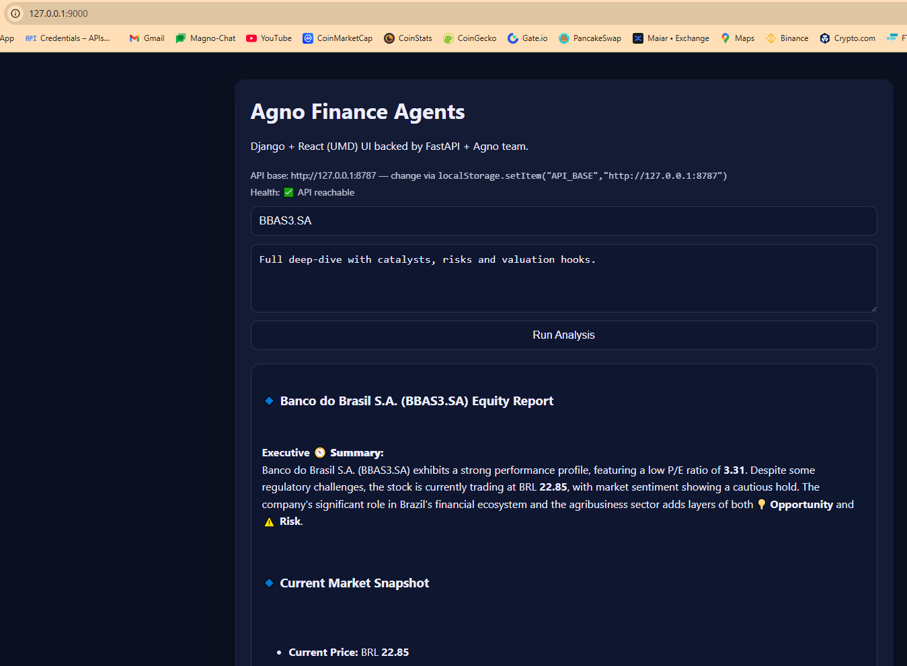

# 🧠 Agno Finance Agents

### Multi-Agent Equity Research Platform (FastAPI + Agno Framework)

> **Purpose:**  
> A production-ready **multi-agent research system** for **equity analysis**, featuring persistent memory, reasoning (ReAct pattern), self-critique, and robust guardrails.
>
> Built for **financial research demonstrations**, showfloor events, and AI-driven analysis pipelines.

---

## 🚀 Quickstart — Windows Setup Guide

This guide provides a **complete and verified setup** for running the system locally on Windows (PowerShell).

### 🧩 1. Prerequisites

Ensure the following are installed:

- **Python 3.11+** → [Download from python.org](https://www.python.org/downloads/)  
  ✅ _Make sure to check “Add Python to PATH” during installation._
- **Git** → [Download from git-scm.com](https://git-scm.com/download/win)
- **PowerShell 5+** (default on Windows 10/11)

> Verify installations:
>
> ```bash
> python --version
> git --version
> ```

---

### 🧱 2. Clone the Repository

```bash
git clone https://github.com/<YOUR_USERNAME>/agno_finance_agents.git
cd agno_finance_agents
```

---

### 🧰 3. Create and Activate a Virtual Environment

```bash
python -m venv .venv
.\.venv\Scripts\activate
```

Confirm activation:

```bash
where python
```

Should point to:  
`<project_path>\.venv\Scripts\python.exe`

---

### 📦 4. Install Dependencies

You have two setup options:

#### (A) Install from requirements.txt

```bash
pip install --upgrade pip
pip install -r requirements.txt
```

#### (B) (Optional) Editable mode for development

```bash
pip install -e .
```

---

### ⚙️ 5. Environment Configuration

Copy the example environment file and update your credentials:

```bash
copy .env.example .env
```

Then edit `.env` (e.g., in VS Code or Notepad) and set your **OpenAI API key**:

```
OPENAI_API_KEY=sk-xxxxxxxxxxxxxxxxxxxxxxxxxxxxx
```

> Other values (like database URL or environment) can remain default for local testing.

---

### 🧩 6. Run the FastAPI Backend (API)

Start the backend service:

```bash
uvicorn apps.api.main:app --host 127.0.0.1 --port 8787 --access-log --log-level debug
```

Expected output:

```
INFO:     Application startup complete.
INFO:     Uvicorn running on http://127.0.0.1:8787
```

---

### 🔍 7. Verify API Functionality

#### Health Check:

```bash
curl -X POST http://localhost:8787/v1/health
```

#### Example Analysis Request:

```bash
curl -X POST http://localhost:8787/v1/analyze `
     -H "Content-Type: application/json" `
     -d '{"ticker":"BBAS3.SA","prompt":"Full deep-dive with catalysts."}'
```

---

## 🧠 System Architecture Overview

| Component             | Description                                                           |
| --------------------- | --------------------------------------------------------------------- |
| **Agno Teams**        | Coordinates multiple AI agents for structured synthesis.              |
| **Persistent Memory** | SQLite database stores sessions and user memories.                    |
| **Guardrails**        | Input sanitization, ticker validation, domain allowlist, time limits. |
| **Reasoning Layer**   | Implements ReAct reasoning and self-critique logic.                   |
| **FastAPI Layer**     | Serves agent orchestration and exposes REST endpoints.                |

---

## 🧩 Extensibility Guide

| Feature                        | How to Extend                                               |
| ------------------------------ | ----------------------------------------------------------- |
| **Add new agents**             | Define in `agents/` and register in `team_orchestrator.py`. |
| **Change database backend**    | Update `AGNO_DB_URL` in `.env` or modify `core/memory.py`.  |
| **Add domain knowledge / RAG** | Integrate Agno vector DB (Qdrant, Weaviate, etc.).          |
| **Modify guardrails**          | Edit patterns or rules in `core/guardrails.py`.             |

---

## 🖥️ Optional: Web UI (Django + Buildless React)

A minimal **Django app** is included for a lightweight **React dashboard** — no Node.js required.

### Run Backend and Web UI

#### 1️⃣ Start FastAPI backend:

```bash
uvicorn apps.api.main:app --host 127.0.0.1 --port 8787 --access-log --log-level debug
```

#### 2️⃣ Start Django web server:

```bash
python apps/web/manage.py migrate
python apps/web/manage.py runserver 9000
```

Open your browser:  
👉 [http://localhost:9000/](http://localhost:9000/)

---

### 🧩 Web UI Notes

- React and ReactDOM are imported **directly from esm.sh**, so **no bundling or Node.js** is needed.
- To change the backend API endpoint, edit:
  ```
  apps/web/dashboard/static/dashboard/app.umd.js
  ```

**Screenshot Example:**


---

## 🧱 Folder Structure

```
agno_finance_agents/
│
├── agents/                 # Individual agent definitions (equity, research, orchestration)
├── core/                   # Core infrastructure: config, logging, memory, prompts, guardrails
├── tools/                  # Utility functions (e.g., finance_tools.py)
├── apps/                   # API (FastAPI) and Web (Django) entry points
├── requirements.txt        # Dependency list
├── .env.example            # Sample environment variables
└── README.md               # You are here
```

---

## 🧩 Troubleshooting

| Issue                      | Cause                                 | Fix                                 |
| -------------------------- | ------------------------------------- | ----------------------------------- |
| `ModuleNotFoundError`      | Virtual environment not activated     | Run `.\.venv\Scriptsctivate`        |
| `Invalid API Key`          | Missing or incorrect `OPENAI_API_KEY` | Check `.env` contents               |
| `sqlite3.OperationalError` | DB file missing or locked             | Delete `agno_memory.db` and restart |
| `Port already in use`      | Another service on port 8787          | Change port using `--port 8788`     |

---

## 📜 License

**MIT License** — free for personal and commercial use.

---

## 🧩 Summary

✅ **Multi-Agent Collaboration** – Modular AI design  
✅ **Persistent Memory** – Context-aware session storage  
✅ **Guardrails** – Safety, validation, and compliance  
✅ **ReAct Reasoning** – Explainable and iterative logic  
✅ **Production-Ready** – Built for clarity, maintainability, and demonstration excellence
